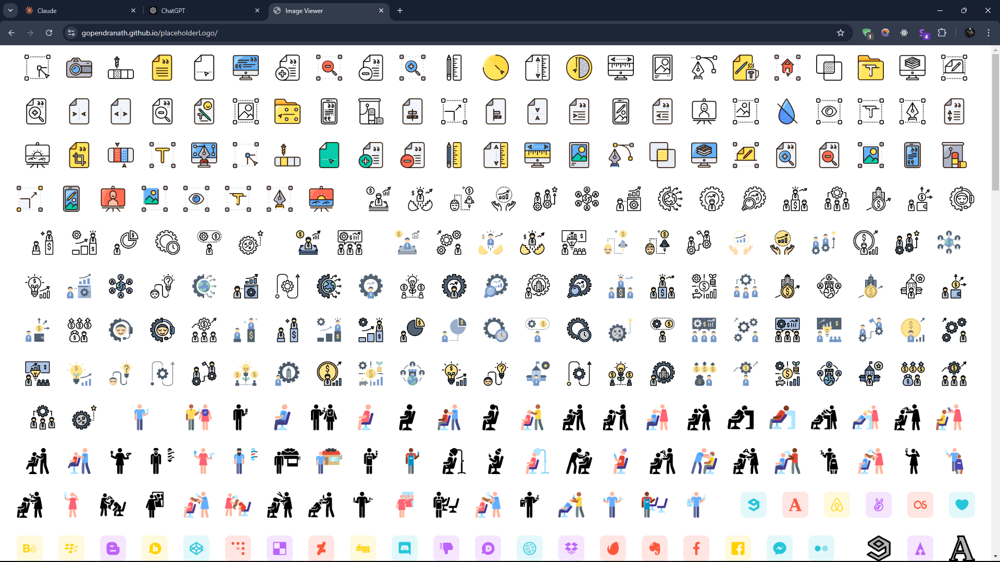

# Dynamic Image Viewer

This project dynamically generates and displays images with sequential numbers from `001` to `999`. The images are loaded from the Flaticon CDN.


### TO USE ANY LOGO, right click on the page and select element selector on the top and copy your desire Logo. Now use any logo cdn link for your project.

## Features

- Displays all images from a specified URL range.
- Dynamically generates image URLs using JavaScript.
- Handles broken images gracefully by hiding them.

## Live Demo

preview - 

*Full desktop interface*

[View the live demo here](https://gopendranath.github.io/placeholderLogo/)

## How It Works

1. **Base URL:** The images are fetched from `https://cdn-icons-png.flaticon.com/512/2111/`.
2. **Dynamic Generation:** A loop generates all possible image URLs from `001` to `999`.
3. **Error Handling:** Any broken images (404 errors) are automatically hidden.

## Technologies Used

- HTML
- JavaScript
- CSS

## How to Use

1. Clone this repository:
    ```bash
    git clone https://github.com/Gopendranath/dynamic-image-viewer.git
    ```
2. Open the `index.html` file in your browser to view the images.

## Contributing

Feel free to contribute to this project! Open an issue or submit a pull request with your ideas or improvements.

## License

This project is licensed under the MIT License.
